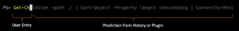
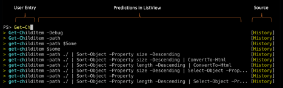
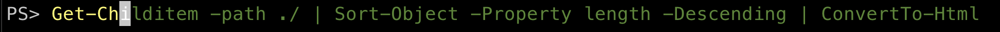

# Motivation

Tab completion has accelerated the success of both new and experienced PowerShell users. New users
get the benefit of discovery; seeing available cmdlets and parameters as options while interactively
typing. Experienced users receive the benefit of acceleration; typing less while using the **<tab>**
key to quickly complete a command.

The increasing amount of technology translates to an increase in cmdlets and full command
complexity. Predictive IntelliSense is an addition to the concept of Tab Completion to assist the
user in successfully completing full commands.

## Predictive IntelliSense

The prediction suggestion appears as colored text following the user’s cursor. This enables new and
experienced users of PowerShell to discover, edit, and execute full commands based on matching
predictions from the user’s history or additional plugins.

Additional plugins enhance historic predictions by providing domain specific commands and task
completions. Predictive IntelliSense includes an extension model to support the registration of
additional plugins.

Predictions may be displayed in either **InlineView** or **ListView** depending on the user’s
preference. Below, predictions are displayed with InlineView.



Below, predictions are displayed with a dropdown in ListView.



## Release plan

Similar to tab completion, Predictive IntelliSense is implemented in both the PowerShell engine and
presented through the PSReadLine module. In an effort to support the most PowerShell users, the
presentation of history-based predictions will be available to the following versions:

- Windows Powershell 5.1
- PowerShell 7.0+

Additional plugins require the the extension framework implemented in the PowerShell engine. Support
for additional plugins is available in the following versions:

- PowerShell 7.2+

History-based predictions initial preview and ship plan:

- PSReadLine 2.1.0-beta2 currently available for download from PSGallery
- PSReadLine 2.1.0-GA will ship with PowerShell 7.1
- PSReadLine 2.1.0-GA will be available for download from PSGallery
- History based prediction in the **InlineView**

Extension/Plugin support initial preview and ship plan:

- PSReadLine 2.2.0-beta1 planned availability in October 20
- PSReadline 2.2.0-beta3 planned availability in June 21
- PSReadLine 2.2.0-GA will ship with PowerShell 7.2
- PSReadLine 2.2.0-GA will be available for download from PSGallery
- Includes support for **InlineView** and **ListView**
- Includes support for additional prediction source **HistoryAndPlugins**
- Note: Windows PowerShell 5.1 and PowerShell 7.0 will only support prediction source **History**.
  PowerShell 7.2+ will support prediction sources **History** and **HistoryAndPlugins**

## Goals/Non-Goals

 Goals:

- Provide suggestions from PSReadLine history
- The user will be able to enable and disable Predictive IntelliSense
- The user will be able to change between InlineView and ListView
- The user will have keyboard shortcuts to navigate and edit a prediction
- The user will be able to register additional plugins when desired
- The user may customize the color of a prediction to support accessibility needs

Non-goals:

- Due to the relatively short length of a session compared to your PSReadline history,
  PowerShell session history is not part of the historical suggestion
- The extension framework doesn't allow a plugin implementation to call into the Runspace where
  PSReadLine is running when providing predictive suggestions.
- VSCode implementation. We agree this is important for a consistent experience and are working to
  bring this feature in a future release, but the user experience for VS Code is outside the scope of this RFC.

## Specification

The proposal is to add Predictive IntelliSense and an extension model to improve the user
interactive experience.

### Key Design Considerations Predictive IntelliSense

Predictive IntelliSense displays the most likely match from command history. The prediction may
change if a better match is found as the user types additional information. The predicted command
may be accepted, edited, or ignored.


### Install and Remove Predictive IntelliSense

Predictive IntelliSense application programming interface (API) is implemented in the PowerShell
engine and presented through the PSReadLine module. To receive the benefits of Predictive
IntelliSense based on your PowerShell version, download and install the PSReadLine module from
PSGallery

The current release is PSReadLine 2.1.0 Beta 2:

```powershell
Install-Module PSReadLine -RequiredVersion 2.1.0-beta2 -AllowPrerelease
```

It is possible to unload or uninstall the PSReadLine module to disable Predictive IntelliSense. This
creates a negative impact to customers as it would remove all features of PSReadLine. For this
reason, Predictive IntelliSense has its own PSReadLine configuration to enable and disable
predictions.

Note - When upgrading PowerShell preview versions, it's important to upgrade to the corresponding
version of PSReadLine. Some beta versions may result in an error when PowerShell starts.

### Enabling and Disabling Predictions

By default, the feature Predictive IntelliSense is disabled. The impact of enabling this feature by
default may cause new and existing users to become confused at the shell prompt. The feature is
enabled and disabled with a PSReadLine command Set-PSReadLineOption that is executed at the shell
prompt or in the user's Profile.

Predictive IntelliSense in PSReadLine 2.1.0-beta2 currently supports the following arguments for
prediction source;

- None - This option disables Predictive IntelliSense
- History - This option uses only the PSReadLine history for predictions

Starting with PSReadLine 2.2.0-beta1, Predictive IntelliSense will support the following arguments
for prediction source;

- None - This option disables Predictive IntelliSense
- History - This option uses only the PSReadLine history for predictions
- HistoryAndPlugins - History provides initial completions, plugins provide additional completions.

To enable Predictive IntelliSense, enter the following command in the shell or in the users Profile:

```powershell
Set-PSReadLineOption -PredictionSource History
```

To disable Predictive IntelliSense, enter the following command in the shell or in the users Profile:

```powershell
Set-PSReadLineOption -PredictionSource None
```

### Changing the Prediction View

Beginning with 2.2.0-beta1, Predictions are displayed in one of two views depending on the user
preference. The default view is InlineView.

- InlineView – This is the default view and displays the prediction inline with the user’s typing.
  This view is similar to other shells Fish and ZSH.
- ListView – ListView provides a dropdown list of predictions below the line the user is typing.
  Users may quickly scan the list, highlight and select the desired prediction.

Users may change the view at the command line using the keybinding F2 or `Set-PSReadLineOption`. The
`Set-PSReadLineOption` may be stored in the user's profile.

```powershell
Set-PSReadLineOption -PredictionViewStyle ListView
```

### Change the Prediction Color for Accessibility

By default, predictions appear on the same line the user is typing in a different customizable
color. To support accessibility needs, the prediction color is settable in the shell or user's
profile.

The default light-grey prediction text color;

```powershell
Set-PSReadLineOption -Colors @{ InLinePrediction = "`e[38;5;238m"}
```

Starting with PSReadLine 2.1.0-RC1, `Set-PSReadLineOption -Colors` array will include
**InLinePrediction** to set the color of predictive text for **InLineView**.

Beginning with PSReadLine 2.2.0-beta1, `Set-PSReadLineOption -Colors` array will include;

- **ListPredictionColor** to set color for '>' and source names in **ListView**
- **ListPredictionSelectionColor** to set color for the highlighted selection in **ListView**

Examples of user changing prediction color:





```powershell
Set-PSReadLineOption -Colors @{ InLinePrediction = '#8A0303'}
Set-PSReadLineOption -Colors @{ InLinePrediction = '#2F7004'}
Set-PSReadLineOption -Colors @{ InLinePrediction = "`e[36;7;238m"}
```

Multiple types of color code values are supported in PSReadLine. For more information see
Set-PSReadLineOption in
[PSReadLine](https://docs.microsoft.com/en-us/powershell/module/PSReadline/Set-PSReadlineOption?view=powershell-7)

Examples of different color code values:

```powershell
 # Use a ConsoleColor enum
Set-PSReadLineOption -Colors @{ InLinePrediction = 'DarkRed'}
Set-PSReadLineOption -Colors @{ InLinePrediction = [ConsoleColor]::DarkRed}

 # 24 bit color escape sequence on supported terminals
Set-PSReadLineOption -Colors @{ InLinePrediction = "`e[38;5;100m"}

 # RGB value
Set-PSReadLineOption -Colors @{ InLinePrediction = "#8181f7"}
```

### Key Bindings for Predictions

Key bindings control cursor movement and additional features within the prediction. To support users
running Predictive IntelliSense on multiple platforms, key bindings are user-settable in the shell
and a user’s PowerShell profile.

Example of setting a key binding in the shell or user’s profile:

```powershell
Set-PSReadLineOption -HistorySearchCursorMovesToEnd
Set-PSReadLineKeyHandler -Key UpArrow -Function HistorySearchBackward
Set-PSReadLineKeyHandler -Key DownArrow -Function HistorySearchForward
```

List of suggested key bindings defined in **SamplePSReadLineProfile.ps1**

Key Binding   | PSReadLine Function    | Description
------------- | -------------------    | -----------
Up Arrow	    | HistorySearchBackward  | Move backward through history
Down Arrow	  | HistorySearchForward	 | Move forward through history
F7	          | Profile Code	         | Opens Out-GridView with full history
F1	          | Profile Code	         | Opens the Help window for the current command or parameter
F2            | Profile Code           | Switches between InLineView and ListView
Ctrl-b	      | Profile Code	         | Add command to history
Ctrl-q	      | TabCompleteNext	       | Windows style Tab for Emacs mode
Ctrl-Q	      | TabCompletePrevious	   | Windows style Tab for Emacs mode
Ctrl-c	      | Copy	                 | Clipboard interaction for Emacs mode
Ctrl-v	      | Paste	                 | Clipboard interaction for Emacs mode
Ctrl-d,Ctrl-c | CaptureScreen	         | Captures screen for pasting to email or blog
Alt-d	        | ShellKillWord	         | Token based movement bound to Emacs word movement
Alt-Backspace | ShellBackwardKillWord  | “
Alt-b	        | ShellBackwardWord	     | “
Alt-f	        | ShellForwardWord	     | “
Alt-B	        | SelectShellBackwardWord| “
Alt-F	        | SelectShellForwardWord | “
“ or ‘	      | Profile Code	         | Insert Smart quotes
( or { or [	  | Profile Code	         | Insert matching braces
Backspace	    | Profile Code    	     | Delete previous character
Alt-w	        | Profile Code	         | Save current line in history – don’t execute
Ctrl-V	      | Profile Code    	     | Paste clipboard as a Here string
Alt-(	        | Profile Code	         | Insert parenthesis around selection or entire line
Alt-‘	        | Profile Code	         | Toggle quotes on argument under cursor
Alt-%	        | Profile Code	         | Replace aliases with resolved commands

### Search history based on cursor location

The history from PSReadLine is searchable when the user begins typing into the shell.
Users may search the entire prediction history for commands matching under the current cursor
position. Users may search history based on 'Verb', 'Noun' and 'Parameter' of a cmdlet
using the up/down arrow keys.

- Searching history from cmdlet verb.


- Searching history from cmdlet noun.


- Searching history from parameter.


### Edit predictions before accepting the prediction

Users may navigate prediction tokens to make changes to parameters, arguments, and additional
pipeline commands. The prediction model will update the displayed prediction from the closest
matches in PSReadLine history or added provider.

In the example below, a user navigates the prediction, pausing to change the -Property argument and
receiving an updated prediction.


## Prediction Extension Model

Additional plugins enhance historic predictions by providing domain specific commands and task
completions. Plugins register with the PowerShell engine which includes an extension model
to support the registration.

For more information about the extension model, see
[Initial work of the subsystem plugin model](https://github.com/PowerShell/PowerShell/pull/13186)

## Extension Model Goals/Non-Goals

 Goals:

- Provide extension model to support additional plugins
- Support the discovery of plugins using `Get-PSSubsystem`
- Provide Module owners method of registration
- Provide improvements to the predictors through feedback

Non-goals:

- Register/Unregister-Subsystem cmdlets are not planned because it's targeting binary subsystem
  implementations, which should deal with registration/unregistration via APIs.
- Server-side provider privacy is the responsibility of the provider module

## Extension Model Specification

### Discovery of Provider Metadata and Registration

Plugins are registered automatically to the PowerShell engine when the user installs a provider
module. Removal of registration occurs when the module is removed.

Starting with PowerShell 7.1 Preview 7, and as an experimental feature of PowerShell 7.1-RC.1, the
`Get-PSSubsystem` cmdlet is an experimental feature of the `PSSubsystemPluginModel`. To enable the
experimental feature:

```powershell
Enable-ExperimentalFeature -Name PSSubsystemPluginModel
```

To list the currently installed plugins and their respective metadata such as version information:

```powershell
Get-PSSubSystem -Kind CommandPredictor
```

Example output with no additional plugins registered;

```output
Kind              SubsystemType   IsRegistered Implementations
----              -------------   ------------ ---------------
CommandPredictor  ICommandPredic…        False {}
```

Example output with an additional provider registered;

```output
Kind              SubsystemType   IsRegistered Implementations
----              -------------   ------------ ---------------
CommandPredictor  ICommandPredic…         True {Az Predictor}
```
