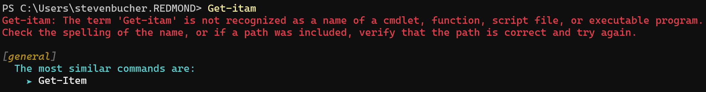
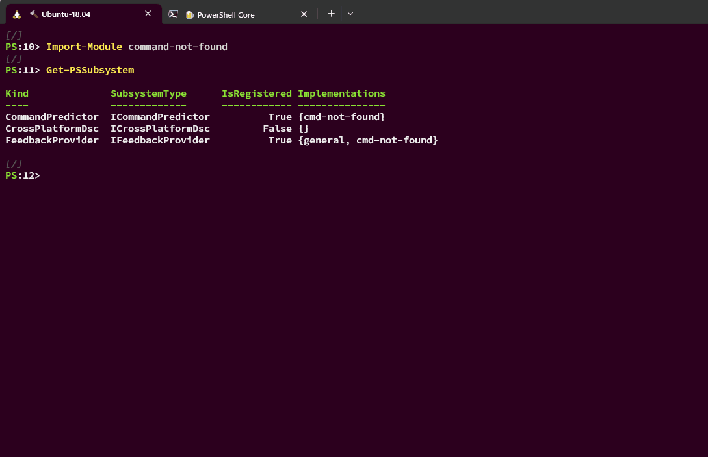

# Feedback Providers

Feedback Providers are PowerShell modules that utilize the `IFeedbackProvider` interface to trigger
feedback on errors, comments, and success events. These providers can help enhance user experience
by providing real-time feedback, notifications, or suggestions based on the execution of PowerShell
commands. This RFC outlines some of the requirements and scenarios for Feedback Providers

## Motivation

    As a PowerShell interactive user,
    I can get feedback on the commands I am running and attemping to run,
    so that I can successfully use the CLI quicker and without distruption to my workflow.

## Specification
_____

## User Interface and User Experience

Feedback providers are triggered on the following:
- **Comments**
- **Success**
- **CommandNotFound**
- **Error**
- **All**

The current user interface schema is as follows:
```
[Name of first feedback provider]
  Required Header:
    ➤ optional action 1
    ➤ optional action 2
    ➤ optional action n
  optional Footer
...
[Name of n feedback provider]
  Required Header:
    ➤ optional action 1
    ➤ optional action 2
    ➤ optional action n
  optional Footer
```

> Note: For the sake of collaboration I am including feedback provider UIs in text rather than
> screenshots. This means the coloring will be off to the final experience.

### On Comment

Comments allow for a more descriptive input for feedback providers to utilize and act upon. One
example implementation could be using a feedback provider as a pass through to an off box A.I model.
This way the more detailed input can be used by a large language model.

```powershell
PS># How do I list the files in my C drive?
[A.I Model]
  One way to list all your files in the C drive is the following:
    ➤ Get-ChildItem -Path C:
```

### On Success

Feedback providers can trigger on successful executions in order to give suggestions or assistance
on potentially "better" ways to utilize a command.

One way we hope to use this is with a feedback provider we are
calling `JSON Adapter` which can help guide users to wrap native commands with adapters that
convert the text output to a machine readable format or the tool like
[jc](https://github.com/kellyjonbrazil/jc). This way users can use native commands just like
PowerShell cmdlets that output an object.

```powershell
PS> uname
Darwin

[JSON Adapter]
  The most similar commands are:
    ➤ uname | uname-json | ConvertFrom-JSON
    ➤ uname | jc --uname | ConvertFrom-JSON
```

### On CommandNotFound

Currently the only trigger on by **_default_** is the CommandNotFound trigger. This triggers specifically
on the `CommandNotFound` exeception thrown by PowerShell. This specifically targets the scenario for
mistyping or not having a particular command installed yet.

```powershell
PS> Get-Itam
Get-Itam: The term 'Get-Itam' is not recognized as a name of a cmdlet, function, script file, or executable program.
Check the spelling of the name, or if a path was included, verify that the path is correct and try again.

[general]
  The most similar commands are:
    ➤ Get-Item
```

What this looks like properly rendered is like so:



We also developed a feedback provider we are calling the `command-not-found` feedback provider which
depends on the `command-not-found` utility available on Linux by default. It can be found
[here](https://github.com/PowerShell/command-not-found). It triggers off the same `CommandNotFound`
execption but is only compatible with linux systems.

### On Error

Feedback providers on errors can also provide suggestions. Although the `CommandNotFound` exception is in fact a type of error, this error trigger encapsulates all other possible errors.

```powershell
PS> rm -rf
Remove-Item: A parameter cannot be found that matches parameter name 'rf'.
[Compatibility]
  It appears you are trying to recursively and forcibly remove files. In PowerShell, the correct syntax would be:
    ➤ rm -r -fo
```

It is up to the feedback provider to decide what error specifically it tries to trigger on.
Currently the entire error record object gets passed to feedback providers so all the information
available in that object is available for the feedback providers to trigger on.

____

## Interacting with Feedback Providers

### Customizability

Currently if a user wants to enable/disable particular feedback providers they need to install the
module and then have it imported in their session. Order of import also determines the ordering when
multiple feedback providers trigger on the same event, **except** for the `general` feedback
provider that triggers on `CommandNotFound` exception. This provider will be on by default and be
the first in the list of suggestions after the execption occurs. For ordering and enabling by
default we encourage the experience of keeping feedback provider modules imported in the users
`$PROFILE`. I.e
```powershell
# In $PROFILE
Import-Module FeedbackProvider1
Import-Module FeedbackProvider2
```
Then in the CLI:
```powershell
PS>something to trigger feedback providers
[FeedbackProvider1]
  Header 1:
    ➤ Action
[FeedbackProvider2]
  Header2:
    ➤ Action
```


### Predictor Tie in

As a way to enhance the CLI users workflow, we want to encourage feedback providers to utilize the `ICommandPredictor` interface as well. This way the workflow can be feedback provider triggered _then_ user immediately gets recommended command predicted to them. Below is an example taken from the [`command-not-found`](https://github.com/PowerShell/command-not-found) feedback provider.





## Goals/Non-Goals

Goals
- Create a new, consistent, UI for assistive feedback for errors, comments, successful executions, and CommandNotFound exceptions.
- Expose necessary information releveant to giving assistence to the user via an interface
- Enable user customizablity of feedback providers to display and order
- Make creation of feedback providers easy for module developers
- Enable the creation of an ecosystem of assistive providers

Non-Goals
- Be a disruptive experience in PowerShell
- Ship many feedback providers by default 

## Open considerations
Questions
- Should the PowerShell engine be responsible for restricting feedback providers from being disruptive?

    - I.e if a feedback provider triggers on **success** _every_ time a user types a particular command, then should the engine restrict that if its never subsequently typed after being provided?

- Do we need a better way to allow users to manage feedback providers?
