# Native Markdown Rendering

Render markdown content on console to improve readability.

## Motivation

Markdown is a common authoring format used by the community.
There is no easy way in PowerShell to visualize a markdown document on console.
Since the PowerShell help is authored in markdown, these components will be used for rendering help content.

## Specification

This RFC proposes to use `VT100` escape sequences to render markdown content.
`ConvertFrom-Markdown` cmdlet as part of `Microsoft.PowerShell.Utility` PowerShell module would consume a string or a file path and output a PSObject containing three properties, `Tokens`, `Html`, `VT100EncodedString`.
The `Tokens` property has the AST for the markdown document from `markdig`.
The `Html` property has the markdown document converted to `HTML`.
The `VT100EncodedString` property has the markdown documented with `VT100` escape sequences.
By default, the `Html` property will be populated.
The `VT100EncodedString` property will be populated only when `-AsVT100EncodedString` is specified.
The `Tokens` property will be populated in all cases.

For converting strings to VT100 coded strings, we will be writing an extension to [markdig](https://github.com/lunet-io/markdig).
The extension will insert VT100 escape sequences as appropriate.

### Specification for `ConvertFrom-Markdown`

```PowerShell

ConvertFrom-Markdown [-Path] <string[]> [-AsVT100EncodedString] [<CommonParameters>]

ConvertFrom-Markdown [-LiteralPath] <string[]> [-AsVT100EncodedString] [<CommonParameters>]

ConvertFrom-Markdown [-InputObject] <psobject> [-AsVT100EncodedString] [<CommonParameters>]

```

#### Parameters

- **Path** : Accepts an array of file paths with markdown content.
- **LiteralPath** : Accepts an array of literal paths with markdown content.
- **InputObject** : Accepts an InputObject of `System.IO.FileInfo`, `string` type.
- **AsVT100EncodedString** : When selected, the `VT100EncodedString` property is populated.

There will be support for changing the colors for various elements using the `Set-MarkdownOption` cmdlet. To retrieve the current settings `Get-MarkdownOption` cmdlet can be used.

#### Output Type

The output type will be `MarkdownInfo` object with properties for `Html`, `VT100EncodedString` and `Tokens`.

### Specification for `Set-MarkdownOption`

```PowerShell

Set-MarkdownOption [-Header1Color <string>] [-Header2Color <string>] [-Header3Color <string>] [-Header4Color <string>] [-Header5Color <string>] [-Header6Color <string>] [-CodeBlockForegroundColor <string>] [-CodeBlockBackgroundColor <string>] [-ImageAltTextForegroundColor <string>] [-LinkForegroundColor <string>] [-ItalicsForegroundColor <string>] [<CommonParameters>]

Set-MarkdownOption -Theme <string> [<CommonParameters>]

Set-MarkdownOption -InputObject <psobject> [<CommonParameters>]

```

The properties can individually customize the rendering on console.
The properties for color must be expressed as a `VT100` escape sequence, like

```PowerShell

Set-MarkdownOption -Header1Color "$([char]0x1b)[7m"

```

Dark will be the default theme.
The individual colors for the dark theme are specified in the subsequent sections.

### Specification for `Get-MarkdownOption`

```PowerShell

Get-MarkdownOption [<CommonParameters>]

```

### Specification for `Export-MarkdownOption`

```PowerShell

Export-MarkdownOption -Path <string> [<CommonParameters>]

Export-MarkdownOption -LiteralPath <string> [<CommonParameters>]

```

Export the current markdown settings to a JSON file.

### Specification for `Import-MarkdownOption`

```PowerShell

Import-MarkdownOption -Path <string> [<CommonParameters>]

Import-MarkdownOption -LiteralPath <string> [<CommonParameters>]

```

Import the markdown settings from the specified file and returns a PSObject of the options.
This can be used as an `InputObject` for `Set-MarkdownOption`.

### Specification for `Show-Markdown`

```Powershell

Show-Markdown -InputObject <psobject[]> [<CommonParameters>]

Show-Markdown -InputObject <psobject[]> -UseBrowser [<CommonParameters>]

```

Render the `VT100EncodedString` property of `MarkdownInfo` on console.
If the `VT100EncodedString` property is null, then a non-terminating error will be thrown.

If the switch `-UseBrowser` is specified, display the content of `Html` property in a web browser.
If the `Html` property is null, then a non-terminating error will be thrown.

## Supported Markdown Elements

We will be supporting a limited set of markdown elements in the initial version.

### Block Elements

The block elements include paragraphs and line breaks, headers, block quotes, code blocks and horizontal rules.

#### Paragraphs and line breaks

These will be rendered as plain text.
Semantic line breaks will be rendered as paragraphs.

#### Headers

VT100 escape sequences for headers are as follows:

| Element |  Markdown | Rendered | Escape Sequences (Dark Theme) | Escape Sequences (Light Theme) |
|---------|-------------|----------|----------|------------|
| ATX Header 1 | 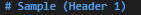 | 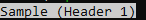 | ESC[7mHeader 1ESC[0m | ESC[7mHeader 1ESC[0m |
| ATX Header 2 | 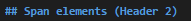 | 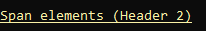 | ESC[4;93mHeader 1ESC[0m | ESC[4;33mHeader 1ESC[0m |
| ATX Header 3 | 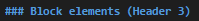 | 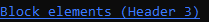 | ESC[4;94mHeader 1ESC[0m | ESC[4;34mHeader 1ESC[0m |
| ATX Header 4 | 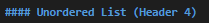 | 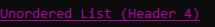 | ESC[4;95mHeader 1ESC[0m | ESC[4;35mHeader 1ESC[0m |
| ATX Header 5 | 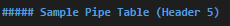 | 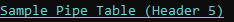 | ESC[4;96mHeader 1ESC[0m | ESC[4;36mHeader 1ESC[0m |
| ATX Header 6 | 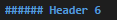 |  | ESC[4;97mHeader 1ESC[0m | ESC[4;30mHeader 1ESC[0m |
| Setext Header 1 |  | 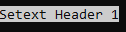 | ESC[7mHeader 1ESC[0m | ESC[7mHeader 1ESC[0m |
| Setext Header 2 |  | 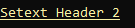 | ESC[4;93mHeader 1ESC[0m | ESC[4;33mHeader 1ESC[0m |

#### Code Blocks

Code blocks will be rendered with a lighter background color and a dark foreground text.
Background color will be applied for the console width.
No syntax highlighting will be done.
`ESC[500@` is used to have sufficiently wide background color.

| Markdown | Rendered | Escape Sequences |
|-------------|----------|----------|
| 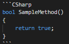 |  | ESC[48;2;155;155;155;38;2;30;30;30mTextESC[500@ESC[0m |

### Span Elements

Span elements will have varying degree of support depending on element type.

#### Links

Links in paragraphs will add double quotes around the link label and append the link URL surrounded by parenthesis.
The link will be colored to differentiate from plain text.

| Markdown | Rendered | Escape Sequences |
|----------|----------|-------------|
| 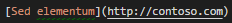 | 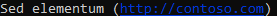 | ESC[4;34m( )ESC[0m |

If the links are part of a container like a pipe table, block quote or list; then just the link label will be shown.

#### Emphasis

Emphasis will be rendered using escape sequence `ESC[1mBold TextESC[0m` and `ESC[36mItalics TextESC[0m` for bold text and italics text respectively.

| Element | Markdown | Rendered | Escape Sequences |
|---------|-------------|----------|----------|
| Bold | 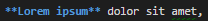 | 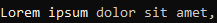 | ESC[1mBold TextESC[0m |
| Italics | 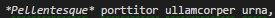 | 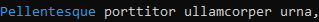| ESC[36mItalics TextESC[0m |

#### Code

Inline code elements will be rendered similar to code blocks, with the exception on background color to not extend beyond the markdown element.

|  Markdown | Rendered | Escape Sequences |
|-------------|----------|----------|
| 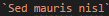 | 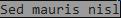 | ESC[48;2;155;155;155;38;2;30;30;30mTextESC[0m`|

#### Images

The alt-text of the image will be surrounded by `[` and `]` and colorized to differentiate from plain text.
Escape code for images alt-text

| Markdown | Rendered | Escape Sequences |
|-------------|----------|----------|
| 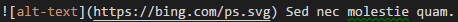 | 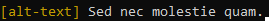 | ESC[33m[alt-text]ESC[0m |

### Rendered output

#### Input Markdown


#### VT100 Rendered output


## Future Work

`Paragraphs and Line Breaks`, `Block Quotes`, `Lists`, `Horizontal Rules`, `Pipe tables` and `HTML code` will be considered for future versions and rendered as plain text in this version.

## Alternate Proposals and Considerations

Introduce a new sigil to define a markdown string.
This would be later rendered using formating files.
The limitations of this approach are:

1. Can be used only in script.
2. Adds a new dependency of `markdig` to `System.Management.Automation`.

## Open Questions

- Investigate paging behavior.
